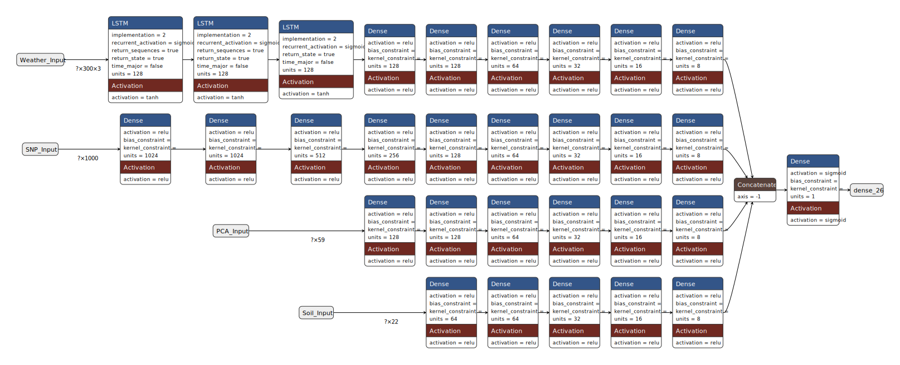

# Integrative-prediction

## General description

This respository contains the supporting code for the article "Integrative multi-environmental genomic prediction in apple" by Jung et al. It consists of two sets of scripts to be run sequentially (1-4; A-G) as well as scripts containing helper functions. Both sets perform genomic predictions of eleven different traits in apple using two different approaches: statistical methods (scripts 1-4) and deep learning (scripts A-G). The phenotypic, enviromic, and imputed genomic data formatted as input files for the provided code are available in Zenodo at (to be updated upon article publication).

## Statistical methods for genomic prediction

The outcomes of the tested statistical genomic prediction models can be reproduced by sequentially running the scripts indexed from 1 to 4. The first two scripts perform operations to process data into the format required for model training. The third script performs genomic predictions integrating genomic and enviromic random effects. The fourth script integrates additive and dominance random effects and inbreeding as a fixed effect into the genomic prediction models.

## Deep learning method for genomic prediction

The deep learning implementation can be reproduced by sequentially running the scripts alphabetically indexed from A to G. Briefly, the first scripts (A-D) perform feature selection and data processing operations to accomodate it into the appropriate format for model training. Script E performs the crossvalidation for a given trait. Finally, scripts E-F compute and save in a comprehensive format interpretation metrics based on Shapley additive explanations (SHAP). Information on how to run each script as well as a short description of inputs and outputs is provided in their headers.

A representation of the deep model architecture generated with Netron (Netron: Visualizer for neural network, deep learning and machine learning models. https://www.lutzroeder.com/ai):

